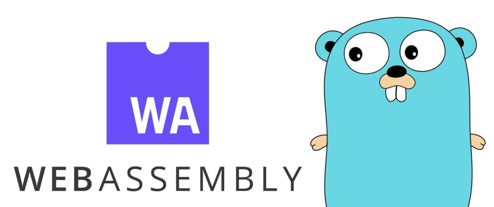
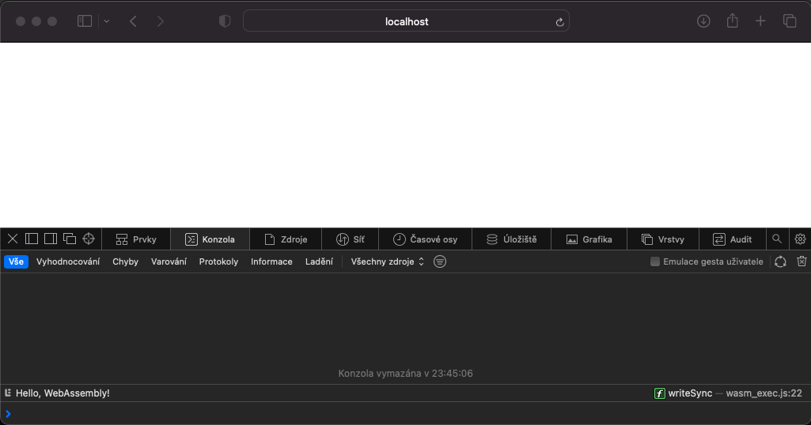

# Go-to-Wasm
Create for web with Go and compile to WebAssembly.

<p align="center">
  
</p> 

(Image by [Denis Sedchenko](https://dev.to/x1unix/go-webassembly-internals-part-1-14aj))


# Go to Wasm `Hello, WebAssembly!`
Install Go [here](https://go.dev/doc/install) and verify installation in your system.
```zsh
➜  ~ go version
go version go1.21.1 darwin/amd64
```   
## Go mod preparation
Prepare Go project for WebAssembly in your folder
```zsh
> mkdir hellowasm-fiddle
> cd hellowasm-fiddle
hellowasm-fiddle> go mod init stkl.cz/hellowasm-fiddle
go: creating new go.mod: module stkl.cz/hellowasm-fiddle
go: to add module requirements and sums:
	go mod tidy
```
Create Go file for your module 
```zsh
hellowasm-fiddle> touch hellowasm-fiddle.go 
```  
fill `hellowasm-fiddle.go` with appropriate dummy code  
```go
package main

import "fmt"

func main() {
	fmt.Println("Hello, WebAssembly!")
}
```
then compile it 
```zsh
hellowasm-fiddle> GOOS=js GOARCH=wasm go build -o main.wasm
hellowasm-fiddle> cp "$(go env GOROOT)/misc/wasm/wasm_exec.js" .
```
and prepare for web.  

Locally serve (for example w/ Python) as `python3 -m http.server`.
## Results
Go to `hellowasm-fiddle` and build project w/ `Makefile`'s make.
```zsh
hellowasm-fiddle> make
GOOS=js GOARCH=wasm go build -o main.wasm
cp "/usr/local/go/misc/wasm/wasm_exec.js" .
```  
Working `Hello, WebAssembly!` 
<p align="center">
  
</p> 

```zsh
hellowasm-fiddle> python3 -m http.server
Serving HTTP on :: port 8000 (http://[::]:8000/) ...
::1 - - [23/Sep/2023 23:31:16] "GET /index.html HTTP/1.1" 200 -
::1 - - [23/Sep/2023 23:31:16] "GET /wasm_exec.js HTTP/1.1" 200 -
::1 - - [23/Sep/2023 23:31:16] "GET /main.wasm HTTP/1.1" 200 -
```  
After running sample `Hello, WebAssembly!` use `clean`.  
```zsh
hellowasm-fiddle> make clean
# Remove build stuff; get back to "initial state"
rm -rf go.sum main.wasm wasm_exec.js
```
# Modules for web applications
In order to prepare middleware with Go we have to prepare packages.
